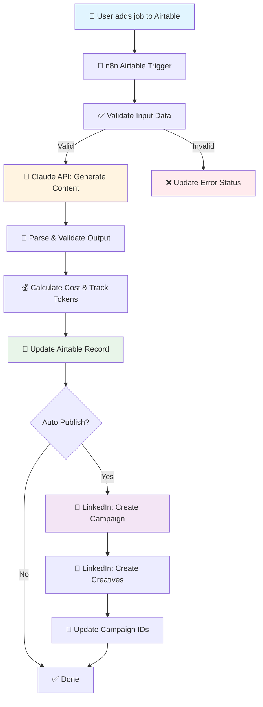

# 🚀 Recruitment Marketing Automation

> **Automated recruitment ad content generation using Claude AI, n8n, and Airtable**

Transform job descriptions into compelling recruitment ad content automatically. This system generates LinkedIn-optimized headlines, ad copy, and targeting keywords in seconds—eliminating hours of manual copywriting.

---

## 📋 Table of Contents

- [Overview](#overview)
- [Features](#features)
- [Architecture](#architecture)
- [Quick Start](#quick-start)
- [Project Structure](#project-structure)
- [Documentation](#documentation)
- [Cost Analysis](#cost-analysis)
- [Roadmap](#roadmap)
- [Contributing](#contributing)

---

## 🎯 Overview

### The Problem

Recruitment marketing teams spend **30+ minutes** per job crafting ad content for platforms like LinkedIn and Meta. For agencies posting 100+ jobs monthly, this is **50+ hours** of repetitive work.

### The Solution

This n8n workflow automatically:
1. ✅ Monitors Airtable for new job postings
2. 🤖 Generates 3 headline variants + 2 ad copy variants using Claude AI
3. 🎯 Creates targeting suggestions (job titles, skills, interests)
4. 💰 Tracks API costs and validates output quality
5. 📊 Updates Airtable with production-ready content
6. 🚢 (Phase 2) Automatically creates LinkedIn Ad campaigns

**Time savings**: From 30 minutes → **~30 seconds** per job

---

## ✨ Features

### Current (Phase 1)

- [x] **Automated Content Generation**
  - 3 headline variants (outcome, challenge, culture angles)
  - 2 ad copy variants (problem-solution, opportunity framing)
  - Character limit enforcement (80 for headlines, 350 for ad copy)

- [x] **Quality Validation**
  - Generic phrase detection (flags clichés like "great opportunity")
  - Duplicate content detection
  - Minimum/maximum length checks
  - Automated quality scoring

- [x] **Cost Tracking**
  - Token usage monitoring
  - Real-time cost calculation
  - Budget alerts (configurable daily limit)

- [x] **Error Handling**
  - Input validation before API calls
  - Retry logic with exponential backoff
  - Detailed error logging
  - Graceful failure handling

- [x] **Testing Suite**
  - Claude API integration tests
  - Error handling validation
  - Airtable trigger tests
  - Sample test data

### Phase 2 (Optional)

- [ ] **LinkedIn Ads Integration**
  - Automatic campaign creation
  - Creative upload (3 variants per job)
  - Targeting configuration
  - Draft status (manual approval workflow)

- [ ] **Meta Ads Integration** (Future)
- [ ] **Performance Analytics** (Future)
- [ ] **A/B Test Framework** (Future)

---

## 🏗️ Architecture

### System Diagram



### Technology Stack

| Component | Technology | Purpose |
|-----------|-----------|---------|
| **Workflow Engine** | n8n Cloud | Orchestration & automation |
| **AI Content Generation** | Claude Sonnet 4 | Natural language generation |
| **Database** | Airtable | Job data storage & UI |
| **Ads Platform** | LinkedIn Ads API | Campaign creation (Phase 2) |
| **Testing** | Bash scripts | Integration & validation tests |

---

## 🚀 Quick Start

### Prerequisites

- n8n cloud account (Starter plan minimum)
- Airtable account with Vacatures table
- Anthropic API key with credits
- (Phase 2) LinkedIn Ads account & API access

### 1. Clone Repository

```bash
git clone https://github.com/your-org/Job-Marketing-Automation.git
cd Job-Marketing-Automation
```

### 2. Configure Airtable

1. Open your Airtable base
2. Add required fields (see [deployment checklist](docs/deployment-checklist.md#phase-2-airtable-configuration-30-min))
3. Create API token at https://airtable.com/create/tokens

### 3. Set Up n8n Workflow

1. Import `workflows/current-production.json` into n8n
2. Configure credentials:
   - Anthropic API (add your key)
   - Airtable Token API
3. Update Parse Data node with validation from `lib/error-handlers.js`
4. Update Claude API node with improved prompt from `docs/improved-prompts.md`
5. Update Parse Output node with cost tracking

### 4. Test the Workflow

```bash
cd testing-suite

# Set environment variables
export ANTHROPIC_API_KEY="sk-ant-xxx..."
export AIRTABLE_API_KEY="patxxx..."

# Run tests
chmod +x *.sh
./test-claude-api.sh
./test-error-handling.sh
./test-airtable-trigger.sh
```

### 5. Activate Workflow

1. In n8n, click "Active" toggle
2. Add a test job to Airtable
3. Wait 5 minutes (polling interval)
4. Verify content generated successfully

**📚 Full deployment guide**: See [docs/deployment-checklist.md](docs/deployment-checklist.md)

---

## 📁 Project Structure

```
Job-Marketing-Automation/
├── docs/
│   ├── current-workflow-analysis.md   # Analysis of existing workflow
│   ├── improved-prompts.md            # Optimized Claude prompts
│   └── deployment-checklist.md        # Step-by-step deployment guide
├── workflows/
│   ├── current-production.json        # Existing workflow (backup)
│   ├── enhanced-workflow.json         # Optimized workflow (TBD)
│   └── linkedin-ads-extension.json    # Phase 2: LinkedIn integration
├── lib/
│   └── error-handlers.js              # Reusable validation functions
├── testing-suite/
│   ├── test-claude-api.sh             # Claude API integration test
│   ├── test-error-handling.sh         # Error scenario tests
│   ├── test-airtable-trigger.sh       # Airtable trigger test
│   └── test-data/
│       └── test-job.json              # Sample test data (6 test cases)
├── scripts/                            # Deployment & maintenance scripts
└── README.md                           # This file
```

---

## 📚 Documentation

### Core Documentation

| Document | Description |
|----------|-------------|
| [Current Workflow Analysis](docs/current-workflow-analysis.md) | In-depth analysis of existing workflow, identified issues, and recommendations |
| [Improved Prompts](docs/improved-prompts.md) | Production-ready Claude prompts with examples, A/B test variants, and optimization guide |
| [Deployment Checklist](docs/deployment-checklist.md) | Complete deployment guide with phase-by-phase instructions |
| [Error Handlers Library](lib/error-handlers.js) | Reusable JavaScript functions for validation, parsing, and cost tracking |

### Key Findings from Analysis

#### 🔴 Critical Issue: Duplicate Processing

The current workflow **calls Claude API twice** for each job, doubling costs and latency:

- **Current**: ~$0.009 per job, 20-30s execution time
- **Optimized**: ~$0.0045 per job, 10-15s execution time
- **Savings**: 50% cost reduction, 50% faster

**Recommendation**: Remove duplicate nodes 6-9 (Parse Data1, HTTP Request, Parse Output1, Update record)

#### Other Improvements

1. **Add retry logic** to Claude API call (currently missing)
2. **Improve prompt quality** with few-shot examples and explicit schema
3. **Implement cost tracking** (token usage, estimated cost per job)
4. **Add input validation** before expensive API calls
5. **Quality checks** for generic phrases and character limits

---

## 💰 Cost Analysis

### Per-Job Costs (Optimized Workflow)

```
Claude Sonnet 4 API:
├─ Input: ~500 tokens × $0.000003 = $0.0015
├─ Output: ~1000 tokens × $0.000015 = $0.015
└─ Total per job: ~$0.0165

Airtable API calls: FREE (within limits)
n8n execution: Included in plan
```

### Monthly Costs (100 jobs)

```
Platform Costs:
├─ Claude API: $1.65
├─ n8n Cloud (Starter): $20.00
├─ Airtable (Free tier): $0.00
└─ Total: ~$21.65/month

ROI Calculation:
├─ Manual copywriting: 50 hours/month × €50/hour = €2,500
├─ With automation: 8 hours review × €50/hour = €400
├─ Platform costs: €21.65
├─ Total automated: €421.65
└─ SAVINGS: ~€2,078/month (83% reduction)
```

### LinkedIn Ads Costs (Phase 2)

```
API usage: FREE
Ad spend: Your budget (€50/day recommended per campaign)

Note: This is separate from automation costs
```

---

## 🗺️ Roadmap

### ✅ Phase 1: Core Automation (Current)

- [x] Workflow analysis & documentation
- [x] Enhanced error handling
- [x] Improved Claude prompts
- [x] Cost tracking
- [x] Testing suite
- [x] Deployment guide

### 🚧 Phase 2: LinkedIn Ads Integration (In Progress)

- [x] Workflow design
- [x] LinkedIn API integration nodes
- [ ] OAuth setup documentation
- [ ] Testing with real LinkedIn account
- [ ] Campaign approval workflow

### 🔮 Phase 3: Advanced Features (Future)

- [ ] **Meta Ads Integration**
  - Similar to LinkedIn but with different character limits
  - Image generation integration (DALL-E/Midjourney)

- [ ] **A/B Testing Framework**
  - Route 50% traffic to Prompt Variant A, 50% to B
  - Track performance metrics (CTR, conversion rate)
  - Auto-optimize based on results

- [ ] **Performance Analytics**
  - Integration with LinkedIn/Meta APIs for performance data
  - Dashboard showing CTR, CPC, conversions by job/campaign
  - Prompt optimization based on real performance

- [ ] **Multi-language Support**
  - Detect job language (Dutch/English)
  - Auto-adjust prompt tone and examples
  - Support for German, French markets

- [ ] **Custom Branding**
  - Company voice/tone profiles
  - Industry-specific templates
  - Brand guideline compliance checks

---

## 🧪 Testing

### Automated Tests

Run the full test suite:

```bash
cd testing-suite

# Claude API test
./test-claude-api.sh
# Output: ✓ Valid JSON, ✓ Character limits OK, ✓ Cost < $0.01

# Error handling test
./test-error-handling.sh
# Output: ✓ 9/9 tests passed

# Airtable trigger test (requires API key)
export AIRTABLE_API_KEY="patxxx..."
./test-airtable-trigger.sh
# Output: ✓ Record created, workflow triggered
```

### Manual Testing

1. Add test job to Airtable (use test-job.json as template)
2. Wait for workflow execution (5 min poll interval)
3. Verify:
   - Status = "Done" (not "Error" or blank)
   - All headline/copy fields populated
   - Tokens_Used and Estimated_Cost fields filled
   - Quality_Issues either empty or contains valid warnings

### Test Coverage

- ✅ Valid input data (complete job posting)
- ✅ Minimal input data (only required fields)
- ✅ Invalid data (missing description, too short)
- ✅ Edge cases (very long descriptions, special characters)
- ✅ Claude API errors (timeout, rate limit, invalid response)
- ✅ Airtable errors (update failure, invalid fields)
- ✅ Generic phrase detection
- ✅ Character limit enforcement

---

## 🤝 Contributing

### Development Workflow

1. Create feature branch: `git checkout -b feature/your-feature`
2. Make changes
3. Test thoroughly (run test suite)
4. Update documentation
5. Commit: `git commit -m "feat: description"`
6. Push: `git push origin feature/your-feature`
7. Create Pull Request

### Commit Message Format

Follow [Conventional Commits](https://www.conventionalcommits.org/):

```
feat: add LinkedIn campaign creation
fix: resolve duplicate API calls issue
docs: update deployment checklist
test: add validation test for edge cases
refactor: extract validation logic to library
```

### Code Quality Standards

- **JavaScript (n8n nodes)**:
  - Always use try-catch
  - Log structured errors
  - Add comments for complex logic
  - Follow existing code style

- **Bash scripts**:
  - Use `set -e` (exit on error)
  - Add colored output for readability
  - Include usage documentation

- **Documentation**:
  - Keep README up to date
  - Document all configuration changes
  - Include examples where helpful

---

## 📄 License

This project is proprietary software. All rights reserved.

---

## 📞 Support

### Internal Team

- **Technical Issues**: Create GitHub issue
- **Workflow Questions**: Check [deployment checklist](docs/deployment-checklist.md)
- **Prompt Optimization**: See [improved prompts guide](docs/improved-prompts.md)

### External Resources

- [n8n Community](https://community.n8n.io/)
- [Anthropic Documentation](https://docs.anthropic.com/)
- [Airtable API Reference](https://airtable.com/developers/web/api/introduction)
- [LinkedIn Marketing API](https://learn.microsoft.com/en-us/linkedin/marketing/)

---

## 🙏 Acknowledgments

- **n8n** for the powerful workflow automation platform
- **Anthropic** for Claude AI's excellent content generation capabilities
- **Airtable** for the flexible database and API

---

**Built with** ❤️ **by the RVE Studios team**

**Last Updated**: 2025-12-12
**Version**: 1.0.0
