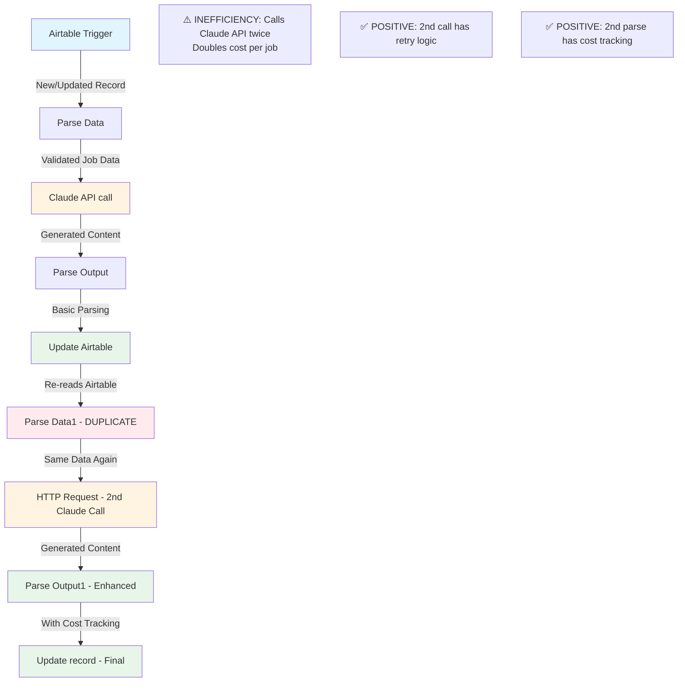
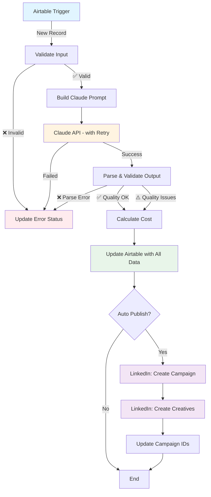

# Current Workflow Analysis - Job Marketing Content Generation

## Executive Summary

**Status**: ✅ Operational (With redundancy issues)
**Platform**: n8n Cloud
**Main Function**: Automated Dutch recruitment ad content generation using Claude AI
**Critical Finding**: ⚠️ **Workflow has duplicate nodes** - processing same data twice

## Actual Workflow Architecture (From JSON)

### Data Flow Diagram



## Critical Finding: Duplicate Processing

### **Issue**: The workflow processes each job TWICE

**Current Flow**:
1. **First pass**: Airtable Trigger → Parse Data → Claude API call → Parse Output → Update Airtable
2. **Second pass**: Parse Data1 (identical) → HTTP Request (another Claude call) → Parse Output1 (enhanced) → Update record

**Impact**:
- 💰 **2x API costs** (~$0.009 per job instead of ~$0.0045)
- ⏱️ **2x latency** (~20-30s instead of ~10-15s)
- 🔄 Claude generates content twice for the same job

**Why this exists** (hypothesis):
- Original workflow was simple (first 5 nodes)
- Enhanced features (cost tracking, quality validation) added in second flow
- Workflow creator duplicated nodes instead of refactoring

**Recommendation**: ✂️ **Remove nodes 6-9**, merge enhancements into nodes 2-5

---

## Node-by-Node Analysis (Actual Configuration)

### 1. Airtable Trigger ✅
**Type**: `n8n-nodes-base.airtableTrigger` v1
**Trigger Field**: `Vacaturetitel`

**Configuration**:
```javascript
{
  pollTimes: { mode: "everyX" },  // Polls every X minutes (default: 5 min)
  baseId: "appRhnA2VngPTd6JO",
  tableId: "tblN1K0pCU7UPiFfs",
  triggerField: "Vacaturetitel"
}
```

**Behavior**:
- Triggers when `Vacaturetitel` field changes (new record OR edit)
- Returns full Airtable record including all fields

**Issues**:
- ⚠️ No filter for Status field → will retrigger on manual edits
- ⚠️ `retryOnFail: false` → trigger failures not handled

---

### 2. Parse Data ⚠️
**Type**: `n8n-nodes-base.code` v2

**Current Code**:
```javascript
const items = $input.all();
const results = [];

for (const item of items) {
  const fields = item.json.fields;
  const recordId = item.json.id;

  // Extract
  const jobTitle = fields['Vacaturetitel'] || '';
  const jobTitleEN = fields['Functietitel EN'] || jobTitle;
  const description = fields['Omschrijving'] || '';
  const requirements = fields['Requirements'] || '';
  const location = fields['Locatie'] || 'Nederland';
  const seniority = fields['Senioriteit'] || 'Medior';
  const salary = fields['Salaris'] || 'Marktconform';
  const usps = fields['USPs'] || '';

  // Validate
  if (!jobTitle || !description) {
    throw new Error('Missing required: Vacaturetitel or Omschrijving');
  }

  results.push({
    json: {
      recordId,
      jobTitle,
      jobTitleEN,
      description,
      requirements,
      location,
      seniority,
      salary,
      usps
    }
  });
}

return results;
```

**Issues Found**:
- ❌ **No try-catch** → errors crash entire workflow
- ❌ **Validation throws error** → no graceful handling
- ❌ **No minimum length checks** → will send empty strings to Claude
- ❌ **No USP usage** → extracted but never used in prompt
- ❌ **No salary usage** → extracted but never used in prompt

---

### 3. Claude API call ⚠️
**Type**: `n8n-nodes-base.httpRequest` v4.3
**Endpoint**: `https://api.anthropic.com/v1/messages`

**Current Configuration**:
```javascript
{
  model: "claude-sonnet-4-20250514",
  max_tokens: 2000,
  messages: [{
    role: "user",
    content: `Je bent recruitment marketing copywriter.

VACATURE:
Titel: {{ $json.jobTitle }}
Omschrijving: {{ $json.description }}
Requirements: {{ $json.requirements }}
Locatie: {{ $json.location }}
Senioriteit: {{ $json.seniority }}

GENEREER (output ALLEEN valid JSON, geen markdown):

{
  "headline_1": "[outcome-driven, max 80 chars]",
  "headline_2": "[challenge-focused, max 80 chars]",
  "headline_3": "[culture angle, max 80 chars]",
  "ad_copy_1": "[problem-solution framing, max 350 chars]",
  "ad_copy_2": "[opportunity-transformation, max 350 chars]",
  "targeting": {
    "linkedin_titles": ["title1", "title2", "title3"],
    "meta_interests": ["interest1", "interest2"],
    "geo": "{{ $json.location }}"
  }
}`
  }]
}
```

**Issues Found**:
- ❌ **No retryOnFail** in this node (exists in duplicate node 7)
- ❌ **No few-shot examples** → inconsistent JSON structure
- ❌ **Vague instructions** → "outcome-driven" is subjective
- ❌ **Missing fields**: Doesn't use `salary`, `usps`, `jobTitleEN`
- ❌ **No system prompt** → could improve consistency
- ⚠️ **Character limits in prompt** → but not enforced by validation

**Positive**:
- ✅ Uses latest Claude Sonnet 4 model
- ✅ Specifies "geen markdown" (no markdown) to avoid wrapping
- ✅ Requests JSON output explicitly

---

### 4. Parse Output ⚠️
**Type**: `n8n-nodes-base.code` v2

**Current Code**:
```javascript
const items = $input.all();
const parseNode = $('Parse Data').all();
const results = [];

for (let i = 0; i < items.length; i++) {
  const response = items[i].json;
  const inputData = parseNode[i].json;

  try {
    let content = response.content[0].text;
    content = content.replace(/```json\n?/g, '').replace(/```/g, '').trim();
    const generated = JSON.parse(content);

    results.push({
      json: {
        recordId: inputData.recordId,
        status: 'Done',
        headline1: generated.headline_1 || '',
        headline2: generated.headline_2 || '',
        headline3: generated.headline_3 || '',
        adCopy1: generated.ad_copy_1 || '',
        adCopy2: generated.ad_copy_2 || '',
        targeting: JSON.stringify(generated.targeting, null, 2),
        generatedAt: new Date().toISOString(),
        errorLog: ''
      }
    });
  } catch (error) {
    results.push({
      json: {
        recordId: inputData.recordId,
        status: 'Error',
        headline1: '',
        headline2: '',
        headline3: '',
        adCopy1: '',
        adCopy2: '',
        targeting: '',
        generatedAt: new Date().toISOString(),
        errorLog: error.message
      }
    });
  }
}

return results;
```

**Positive**:
- ✅ **Has try-catch** → handles parsing errors gracefully
- ✅ **Strips markdown** → handles ```json``` wrapping
- ✅ **Sets error status** → failures visible in Airtable
- ✅ **Logs errors** → error.message saved to errorLog

**Issues**:
- ❌ **No validation** of headline lengths
- ❌ **No validation** of required fields in Claude response
- ❌ **No cost tracking** (exists in duplicate Parse Output1)
- ❌ **No quality checks** (exists in duplicate Parse Output1)

---

### 5. Update Airtable ✅
**Type**: `n8n-nodes-base.airtable` v2.1
**Operation**: Update record

**Fields Updated**:
- `id` (match key)
- `Status` → "Done" or "Error"
- `Headline 1`, `Headline 2`, `Headline 3`
- `Ad Copy 1`, `Ad Copy 2`
- `Targeting` (JSON string)
- `Generated At` (ISO timestamp)
- `Error Log`

**Positive**:
- ✅ Uses record ID for matching (safe)
- ✅ Updates status for tracking
- ✅ Preserves error logs

**Missing**:
- ❌ No `tokensUsed` field (would help with cost tracking)
- ❌ No `estimatedCost` field
- ❌ No `qualityIssues` field

---

### 6-9. Duplicate Nodes ❌

**Parse Data1** (node 6): **Identical to Parse Data** (node 2)
**HTTP Request** (node 7): **Duplicate Claude API call** with improvements:
- ✅ `retryOnFail: true`
- ✅ `waitBetweenTries: 5000` (5 seconds)

**Parse Output1** (node 8): **Enhanced version** with:
- ✅ **Cost tracking**: Extracts `usage.input_tokens` and `usage.output_tokens`
- ✅ **Cost calculation**: `(input * 0.000003) + (output * 0.000015)`
- ✅ **Quality validation**: Checks headline lengths, detects generic phrases
- ✅ **Status logic**: Sets "Review" if quality issues found

**Update record** (node 9): Same as node 5

**Why this is problematic**:
- Makes Claude API call TWICE per job
- Airtable updated TWICE
- Parse Data1 re-reads Airtable (unnecessary API call)
- Doubles execution time

---

## Current Costs & Performance

### Per-Job Execution (Current State)
```
Trigger:              0s
Parse Data:           <1s
Claude API call #1:   5-15s    → $0.0045
Parse Output:         <1s
Update Airtable #1:   1-2s
Parse Data1:          <1s
HTTP Request #2:      5-15s    → $0.0045
Parse Output1:        <1s
Update record #2:     1-2s
────────────────────────────────
Total per job:        15-35s
API cost per job:     ~$0.009  ← 2x expected!
```

### Monthly Projections (100 jobs/month)
```
Claude API:      $0.90
n8n Cloud:       $20.00 (Starter plan assumed)
────────────────────────
Total:           ~$20.90/month
```

**Optimization potential**: Removing duplicate saves **$0.45/month** + faster execution

---

## Airtable Schema (Inferred from JSON)

### Vacatures Table Fields

| Field Name | Type | Purpose | Populated By |
|------------|------|---------|--------------|
| `id` | Auto | Record ID | Airtable |
| `Vacaturetitel` | Single line text | Dutch job title | User |
| `Functietitel EN` | Single line text | English job title | User |
| `Omschrijving` | Long text | Job description | User |
| `Requirements` | Long text | Job requirements | User |
| `Locatie` | Single line text | Location | User |
| `Senioriteit` | Single select | Junior/Medior/Senior | User |
| `Salaris` | Single line text | Salary range | User |
| `USPs` | Long text | Company USPs | User |
| `Status` | Single line text | Done/Error/Review | Workflow |
| `Headline 1` | Single line text | Generated headline | Workflow |
| `Headline 2` | Single line text | Generated headline | Workflow |
| `Headline 3` | Single line text | Generated headline | Workflow |
| `Ad Copy 1` | Long text | Generated ad copy | Workflow |
| `Ad Copy 2` | Long text | Generated ad copy | Workflow |
| `Targeting` | Long text | JSON targeting data | Workflow |
| `Generated At` | Date/Time | Timestamp | Workflow |
| `Error Log` | Long text | Error messages | Workflow |

**Missing fields** (needed for enhancements):
- `Tokens_Used` (Number)
- `Estimated_Cost` (Currency)
- `Quality_Issues` (Long text)
- `LinkedIn_Campaign_ID` (Single line text) - for Phase 2
- `Auto_Publish` (Checkbox) - for Phase 2

---

## Priority Improvements

### 🔴 CRITICAL (Week 1)

1. **Remove Duplicate Nodes** (1 hour)
   - Delete nodes 6-9 (Parse Data1, HTTP Request, Parse Output1, Update record)
   - Merge enhancements from Parse Output1 into Parse Output (node 4)
   - Add `retryOnFail` to Claude API call (node 3)
   - **Impact**: 50% cost reduction, 50% faster execution

2. **Improve Validation in Parse Data** (30 min)
   - Add try-catch wrapper
   - Validate minimum lengths (description > 100 chars)
   - Return error status instead of throwing
   - **Impact**: Prevents API calls for invalid data

3. **Add Airtable Fields** (15 min)
   - Add `Tokens_Used`, `Estimated_Cost`, `Quality_Issues` to Airtable schema
   - Update "Update Airtable" node to populate these fields
   - **Impact**: Cost visibility, quality monitoring

### 🟡 HIGH (Week 2)

4. **Optimize Claude Prompt** (1 hour)
   - Add few-shot examples
   - Include `salary` and `usps` fields
   - Add explicit JSON schema
   - Better instructions for tone/style
   - **Impact**: Better quality output, fewer parsing errors

5. **Add Global Error Handler** (1 hour)
   - Configure workflow error workflow
   - Send error notifications
   - Update Airtable with detailed error info
   - **Impact**: Better debugging, no silent failures

### 🟢 MEDIUM (Week 3-4)

6. **LinkedIn Ads API Integration** (4-6 hours)
   - Add conditional split after Update Airtable
   - Implement campaign creation flow
   - Add creative upload nodes
   - **Impact**: End-to-end automation

---

## Recommended Architecture (Enhanced)



**Benefits of new architecture**:
- Single Claude API call per job
- Validation before expensive operations
- Cost tracking built-in
- Quality monitoring
- Optional LinkedIn automation
- Clear error paths

---

## Questions for Stakeholder

1. **Duplicate nodes**: Can we remove the second flow (nodes 6-9)?
   - It appears to be a duplicate with enhancements
   - Removing it will halve API costs

2. **Dutch vs English**: Should headlines/copy be in Dutch or English?
   - Current prompt is Dutch but generates Dutch content
   - Confirm this matches target audience

3. **LinkedIn Ads**: Do you have:
   - LinkedIn Ads account and account ID
   - API access token (OAuth 2.0)
   - Budget approval for Phase 2 development?

4. **Airtable modifications**: Permission to add fields?
   - Tokens_Used (Number)
   - Estimated_Cost (Currency)
   - Quality_Issues (Long text)
   - Auto_Publish (Checkbox)
   - LinkedIn_Campaign_ID (Single line text)

---

## Next Steps

1. ✅ **Received workflow JSON** - analysis complete
2. ⏳ **Create enhanced workflow** with duplicate removal
3. ⏳ **Build improved prompts** with examples
4. ⏳ **Develop error handlers** library
5. ⏳ **Create testing suite** for validation
6. ⏳ **Design LinkedIn Ads extension** (Phase 2)
7. ⏳ **Write deployment checklist**

**Ready to proceed with implementation!**
