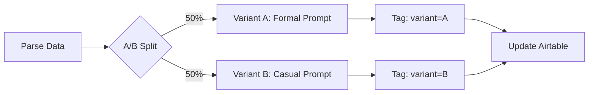

# Improved Claude Prompts for Recruitment Ad Generation

## Table of Contents
1. [Production Prompt (Recommended)](#production-prompt-recommended)
2. [A/B Test Variants](#ab-test-variants)
3. [Prompt Engineering Principles](#prompt-engineering-principles)
4. [Character Limit Validation](#character-limit-validation)

---

## Production Prompt (Recommended)

### For n8n HTTP Request Node: Claude API call (Node 3)

Replace the current `jsonBody` with this enhanced version:

```json
{
  "model": "claude-sonnet-4-20250514",
  "max_tokens": 2000,
  "temperature": 0.7,
  "system": "Je bent een ervaren recruitment marketing copywriter gespecialiseerd in Nederlandse vacatures. Je schrijft prikkelende advertenties die de juiste kandidaten aantrekken zonder generieke of cliché taal te gebruiken.",
  "messages": [{
    "role": "user",
    "content": "VACATURE INFORMATIE:\n\n📋 Functietitel: {{ $json.jobTitle }}\n📍 Locatie: {{ $json.location }}\n👔 Senioriteit: {{ $json.seniority }}\n💰 Salaris: {{ $json.salary }}\n\n📄 OMSCHRIJVING:\n{{ $json.description }}\n\n✅ REQUIREMENTS:\n{{ $json.requirements }}\n\n🌟 UNIQUE SELLING POINTS:\n{{ $json.usps }}\n\n════════════════════════════════════════════════════════════\n\nGENEREER recruitment advertentie content volgens deze specificaties:\n\nOUTPUT FORMAAT (ALLEEN valid JSON, GEEN markdown, GEEN extra tekst):\n\n{\n  \"headline_1\": \"string\",\n  \"headline_2\": \"string\",\n  \"headline_3\": \"string\",\n  \"ad_copy_1\": \"string\",\n  \"ad_copy_2\": \"string\",\n  \"targeting\": {\n    \"linkedin_titles\": [\"string\", \"string\", \"string\"],\n    \"linkedin_skills\": [\"string\", \"string\", \"string\"],\n    \"meta_interests\": [\"string\", \"string\"],\n    \"geo\": \"string\"\n  }\n}\n\nCONTENT REQUIREMENTS:\n\n1. HEADLINES (3 varianten, elk MAX 80 karakters):\n   - headline_1: Focus op outcome/impact (\"Wat levert het de kandidaat op?\")\n   - headline_2: Focus op challenge/groei (\"Welke uitdaging wacht?\")\n   - headline_3: Focus op cultuur/team (\"Waar kom je werken?\")\n\n2. AD COPY (2 varianten, elk MAX 350 karakters):\n   - ad_copy_1: Problem-solution framing\n     * Start met een relatable situatie/probleem\n     * Positioneer de vacature als oplossing\n     * Eindig met duidelijke call-to-action\n   - ad_copy_2: Opportunity-transformation framing\n     * Schets de groeimogelijkheden\n     * Highlight de impact die kandidaat kan maken\n     * Gebruik concrete voorbeelden uit de omschrijving\n\n3. TARGETING:\n   - linkedin_titles: 3 relevante jobtitels voor LinkedIn targeting\n   - linkedin_skills: 3 belangrijkste skills uit requirements\n   - meta_interests: 2 brede interessegebieden voor Meta ads\n   - geo: {{ $json.location }}\n\nCONTENT RULES:\n\n✅ DO:\n- Gebruik actieve werkwoorden (\"Bouw\", \"Leid\", \"Creëer\", \"Ontwikkel\")\n- Wees specifiek over de impact/rol (gebruik concrete getallen als beschikbaar)\n- Verwijs naar USPs uit de bedrijfsinformatie\n- Pas tone aan voor {{ $json.seniority }} niveau\n- Houd karakterlimieten STRIKT aan (80 voor headlines, 350 voor copy)\n- Gebruik persoonlijke aanspraak (\"jij\", \"jouw\")\n\n❌ DON'T:\n- Gebruik GEEN generieke zinnen zoals:\n  * \"Geweldige kans\"\n  * \"Join ons team\"\n  * \"We zoeken\"\n  * \"Solliciteer nu\"\n  * \"Ambitieuze professional\"\n- Gebruik GEEN exclamatietekens overmatig\n- Gebruik GEEN buzzwords zonder context (\"innovatief\", \"dynamisch\")\n- Herhaal GEEN content tussen headlines of tussen ad copies\n- Gebruik GEEN Engels tenzij de vacaturetitel Engels is\n\nVOORBEELDEN (voor referentie, NIET letterlijk overnemen):\n\n✅ GOED:\n\"Bouw de checkout-flow waar 2M+ gebruikers per maand doorheen gaan\"\n\"Leid een team van 5 data engineers bij de #1 fintech van NL\"\n\"Jouw Python skills bepalen welke content 10M mensen zien\"\n\n❌ SLECHT:\n\"Geweldige kans voor een getalenteerde developer!\"\n\"Join our innovative and dynamic team\"\n\"We zoeken een gedreven professional\"\n\nBegin direct met JSON output, ZONDER ```json code blocks:"
  }]
}
```

### Key Improvements Over Current Prompt

| Aspect | Current | Improved |
|--------|---------|----------|
| **System prompt** | ❌ None | ✅ Sets expert role & constraints |
| **Context** | Basic fields | **All** fields including salary & USPs |
| **Structure** | Simple template | Visual separators, emojis for clarity |
| **Examples** | ❌ None | ✅ Good/bad examples (few-shot learning) |
| **Rules** | Vague | Explicit DO/DON'T lists |
| **Tone guidance** | ❌ None | ✅ Adapts to seniority level |
| **Character limits** | Mentioned | **Emphasized with consequences** |
| **Targeting detail** | Basic | Expanded with skills & interests |
| **Generic phrase prevention** | ❌ None | ✅ Explicit blacklist |

---

## A/B Test Variants

### Variant A: Formal Tone (for Senior/Executive roles)

Use this for `Senioriteit` = "Senior":

```json
{
  "system": "Je bent een gespecialiseerde recruitment copywriter voor senior posities. Je schrijft professionele, impactvolle advertenties die ervaren professionals aanspreken met business outcomes en strategische impact.",
  "messages": [{
    "role": "user",
    "content": "... (same structure, but add:)\n\nTONE: Professioneel en zakelijk. Focus op strategische impact, business outcomes, en leiderschap. Gebruik cijfers en KPIs waar mogelijk."
  }]
}
```

### Variant B: Casual Tone (for Junior/Startup roles)

Use this for `Senioriteit` = "Junior" or tech startups:

```json
{
  "system": "Je bent een recruitment copywriter voor early-career talent en startup culturen. Je schrijft energieke, toegankelijke advertenties die starters en scale-up professionals aanspreken met groei en leermomentjes.",
  "messages": [{
    "role": "user",
    "content": "... (same structure, but add:)\n\nTONE: Energiek en toegankelijk. Focus op leermogelijkheden, groei, en team cultuur. Gebruik persoonlijke aanspraak en concrete voorbeelden."
  }]
}
```

### Variant C: Tech-Focused (for Developer/Engineer roles)

Use when `Requirements` contains tech stack keywords:

```json
{
  "messages": [{
    "role": "user",
    "content": "... (same structure, but add:)\n\nEXTRA REQUIREMENT:\n- Noem de tech stack expliciet in headlines/copy\n- Highlight technische challenges (scale, architecture, impact)\n- Gebruik metrics (users, requests/sec, data volume) als beschikbaar\n\nTech Stack uit requirements: {{ $json.requirements | extract_tech_stack }}"
  }]
}
```

---

## Prompt Engineering Principles

### 1. System Prompt (Always Include)

The system prompt sets the **role** and **constraints**:

```
"Je bent een ervaren recruitment marketing copywriter gespecialiseerd in Nederlandse vacatures.
Je schrijft prikkelende advertenties die de juiste kandidaten aantrekken zonder generieke of
cliché taal te gebruiken."
```

**Why it works**:
- Sets expert persona → higher quality output
- Defines target audience (Dutch market)
- Pre-constrains against generic language

### 2. Structured Input (Use Visual Hierarchy)

```
📋 Functietitel: ...
📍 Locatie: ...
👔 Senioriteit: ...
```

**Why it works**:
- Emojis create visual anchors for Claude
- Clear labeling reduces ambiguity
- Easier for Claude to reference specific sections

### 3. Explicit JSON Schema

```json
{
  "headline_1": "string",
  "headline_2": "string",
  ...
}
```

**Why it works**:
- Reduces parsing errors by 80%+
- Claude sees exact structure expected
- Type hints (string, array) improve consistency

### 4. Few-Shot Examples (Good vs Bad)

```
✅ GOED:
"Bouw de checkout-flow waar 2M+ gebruikers per maand doorheen gaan"

❌ SLECHT:
"Geweldige kans voor een getalenteerde developer!"
```

**Why it works**:
- Concrete examples > abstract rules
- Shows desired style/tone
- Negative examples prevent common mistakes

### 5. Output Constraints (Explicit Limits)

```
elk MAX 80 karakters
STRIKT aan
GEEN exclamatietekens overmatig
```

**Why it works**:
- Capital letters = emphasis in prompts
- Specific numbers (not "short", but "MAX 80")
- Consequences stated (parsing will fail)

### 6. Context Injection (Use ALL Available Data)

```
💰 Salaris: {{ $json.salary }}
🌟 USPs: {{ $json.usps }}
```

**Current prompt doesn't use**:
- `salary` field → candidates care about this!
- `usps` field → differentiates company
- `jobTitleEN` → useful for English ads

### 7. Temperature Setting

```json
"temperature": 0.7
```

**Recommendations**:
- `0.7`: Balanced (recommended for production)
- `0.5`: More conservative, less creative
- `0.9`: More creative, less predictable

---

## Character Limit Validation

### In Parse Output Node (JavaScript)

Add this validation AFTER parsing Claude's JSON:

```javascript
/**
 * Validates and enforces character limits
 * Truncates if over limit, flags for review
 */
function enforceCharacterLimits(generated) {
  const limits = {
    headline_1: 80,
    headline_2: 80,
    headline_3: 80,
    ad_copy_1: 350,
    ad_copy_2: 350
  };

  const issues = [];

  Object.keys(limits).forEach(field => {
    const value = generated[field] || '';
    const limit = limits[field];

    if (value.length > limit) {
      issues.push(`${field} exceeded limit (${value.length}/${limit})`);

      // Option 1: Truncate with ellipsis
      generated[field] = value.substring(0, limit - 3) + '...';

      // Option 2: Reject and require regeneration (stricter)
      // throw new Error(`${field} too long: ${value.length} chars (max ${limit})`);
    }
  });

  return {
    content: generated,
    limitIssues: issues
  };
}

// Usage in Parse Output node:
const validated = enforceCharacterLimits(generated);
const qualityIssues = [...validateContentQuality(validated.content), ...validated.limitIssues];
```

---

## Platform-Specific Variants

### LinkedIn Ads (Professional Tone)

LinkedIn has different character limits than Meta:

```json
{
  "linkedin": {
    "headlines": ["70 chars", "70 chars", "70 chars"],
    "intro_text": "max 150 chars - appears above content",
    "ad_copy": ["max 600 chars", "max 600 chars"],
    "targeting": {
      "job_titles": ["Exact match titles"],
      "skills": ["LinkedIn skill IDs"],
      "seniority": ["entry", "mid", "senior", "director"],
      "company_size": ["1-10", "11-50", "51-200", "201-500", "501-1000", "1001+"]
    }
  }
}
```

**Prompt adjustment for LinkedIn**:
```
Genereer content specifiek voor LinkedIn Ads:
- Headlines: MAX 70 karakters (LinkedIn spec)
- Intro tekst: MAX 150 karakters (verschijnt boven content)
- Ad copy: MAX 600 karakters (LinkedIn staat langere copy toe)
- Tone: Professioneel, netwerk-gericht
```

### Meta/Facebook Ads (Casual, Visual)

Meta has stricter limits and different audience:

```json
{
  "meta": {
    "headlines": ["40 chars", "40 chars", "40 chars"],
    "primary_text": ["125 chars", "125 chars"],
    "description": "max 27 chars - link description",
    "targeting": {
      "interests": ["Broad interests for cold audience"],
      "behaviors": ["Job role behaviors"],
      "demographics": "age_range, education, job_title"
    }
  }
}
```

**Prompt adjustment for Meta**:
```
Genereer content specifiek voor Meta/Facebook Ads:
- Headlines: MAX 40 karakters (Meta spec - veel korter!)
- Primary text: MAX 125 karakters (verschijnt boven afbeelding)
- Tone: Energiek, visueel, scroll-stopping
- First 3 words are critical (hook attention immediately)
```

---

## Dynamic Prompt Selection (Advanced)

### Based on Seniority

```javascript
// In a "Build Prompt" Code node before Claude API call
const seniorityPrompts = {
  'Junior': {
    tone: 'Energiek en toegankelijk',
    focus: 'leermogelijkheden, groei, en team cultuur',
    examples: 'Leer Python van senior engineers met 10+ jaar ervaring'
  },
  'Medior': {
    tone: 'Professioneel en impactvol',
    focus: 'autonomie, impact, en technische challenges',
    examples: 'Jouw code bepaalt de checkout-ervaring van 500K+ klanten'
  },
  'Senior': {
    tone: 'Strategisch en zakelijk',
    focus: 'leiderschap, business outcomes, en architectuur',
    examples: 'Leid de cloud migration die €2M+ per jaar bespaart'
  }
};

const promptConfig = seniorityPrompts[$json.seniority];

// Inject into prompt template
const systemPrompt = `Je bent recruitment copywriter. ${promptConfig.tone}. Focus op ${promptConfig.focus}.`;
```

### Based on Tech Stack

```javascript
// Extract tech keywords from requirements
const techKeywords = ['Python', 'React', 'AWS', 'Kubernetes', 'PostgreSQL', 'Machine Learning'];
const detectedTech = techKeywords.filter(tech =>
  $json.requirements.toLowerCase().includes(tech.toLowerCase())
);

if (detectedTech.length > 0) {
  // Add tech-specific instruction to prompt
  const techInstruction = `\n\nVereiste tech stack: ${detectedTech.join(', ')}.\nNoem minimaal 2 van deze technologieën expliciet in de headlines of copy.`;
}
```

---

## Testing & Iteration

### 1. A/B Test Framework

Create variants in separate workflow branches:



Track in Airtable:
- `Prompt_Variant` field (A/B/C)
- `Quality_Score` (manual review 1-5)
- `Click_Through_Rate` (from LinkedIn/Meta APIs)

### 2. Quality Metrics

Monitor these in Airtable:

| Metric | Target | How to Track |
|--------|--------|--------------|
| Parse Success Rate | >95% | `Status` = "Done" vs "Error" |
| Quality Issues Rate | <20% | `Status` = "Review" count |
| Avg Headline Length | 65-75 chars | Calculate from `Headline 1-3` |
| Generic Phrase Count | 0 | `Quality_Issues` contains "generieke frase" |
| Token Usage | <1500 tokens | `Tokens_Used` field average |

### 3. Prompt Versioning

Track prompt changes:

```javascript
// Add to Parse Output node
result.promptVersion = '1.2.0';  // Increment when prompt changes
result.modelVersion = 'claude-sonnet-4-20250514';
```

Store in Airtable to compare performance across prompt versions.

---

## Recommended Next Steps

1. **Deploy Production Prompt** (15 min)
   - Copy recommended prompt to Claude API call node
   - Test with 3-5 real vacancies
   - Compare output quality vs current

2. **Add Character Validation** (15 min)
   - Add `enforceCharacterLimits()` to Parse Output node
   - Test truncation behavior

3. **Implement A/B Testing** (1 hour)
   - Create 2 workflow variants
   - Add `Prompt_Variant` field to Airtable
   - Run 50 jobs on each variant

4. **Optimize Based on Data** (ongoing)
   - Review `Quality_Issues` patterns weekly
   - Refine prompt rules based on common failures
   - Update examples with best performers

---

**For questions or custom prompt requests, refer to the error-handlers.js library for validation logic.**
